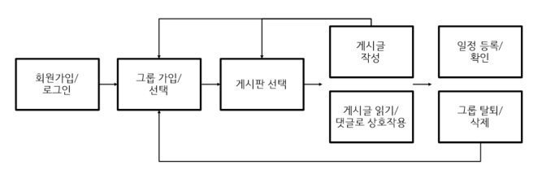

# STUDY CHECK PROJECT

---

### 순서

- [프로젝트 배경](#프로젝트-배경)
- [팀 구성 및 역할](#팀-구성-및-역할)
- [수행 절차 및 방법](#수행-절차-및-방법)
- [설계](#설계)
- [수행 결과 및 시연](#수행-결과-및-시연)
- [개선 방안](#개선-방안)

---

## 프로젝트 배경

이 프로젝트는 비대면 스터디 모임을 위한 웹 애플리케이션 제작입니다. 코로나로 인해 비대면 활동이 활성화 되면서 혼자 공부하기 힘들 때, 다른 사람들과 내용을 공유하고 싶거나 강제성이 필요한 사람들을 위한 곳입니다.

#### 개발환경

- 서버: Django
- DB: SQLite3
- Front-end: HTML/CSS

#### 구조

---

## 팀 구성 및 역할

---

## 수행 절차 및 방법

---

## 설계

#### 스토리보드

#### DB구성

#### URLconf 설계

---

## 수행결과 및 시현

로그인 화면

회원가입 화면

로그인을 하면 그룹검색 페이지로 이동하게 됩니다.

그룹을 선택하면 그룹상세보기가 나오게 됩니다.

지원동기를 입력하지 않으면 가입신청시 알람이 뜨도록 설정하였습니다.

가입 정원이 차면 가입신청이 불가능합니다. 이 외에도 이미 가입한 그룹, 가입승인 대기중에대한 메시지 표시도 나타나게 됩니다.

관리자는 가입신청자에 대해 그룹승인 목록에서 가입신청을 승인하거나 거부할 수 있습니다.

그룹생성 목록에서 원하는 그룹을 생성할 수 있습니다.

자신이 생성한 그룹은 삭제할 수 있으며,

자신이 가입한 그룹은 탈퇴할 수 있습니다.

자신이 생성하거나 가입이 된 그룹은 그룹보기목록에서 확인할 수 있습니다. 

그룹보기 목록에서 그룹을 선택하면 게시판이 보여지게 됩니다. 

게시글 등록 버튼을 통해 게시글 생성이 가능하고,

게시판 관리를 통해 게시판을 생성, 삭제할 수 있습니다.

.PNG)

.PNG)

캘린더 보기에 들어가시면 그룹의 일정을 달력 형태로 볼 수 있고,

RESISTER YOUR SCHEDULE 버튼을 통해 일정을 작성하실 수 있습니다.

생성된 일정 제목은 달력에 표시됩니다.

달력의 일정을 클릭하시면 일정 수정 및 삭제가 가능합니다.

---

## 개선방안

1. 그룹 참여 승인/거부 알람 기능
2. 사용자간 채팅기능 추가
3. 캘린더 UI변경(일정연결)